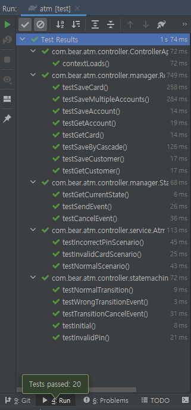
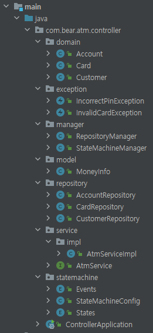
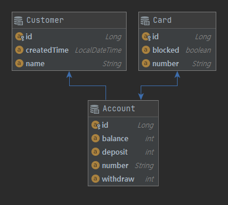
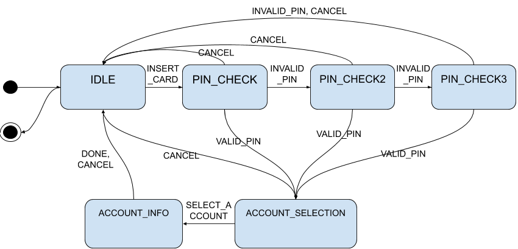

# ATM controller
## Abstract
- Developing simple ATM controller
### Requirements
- [x] Should be implemented following flow
    - [x] Insert Card
    - [x] PIN number
    - [x] Select Account
    - [x] See Balance/Deposit/Withdraw
- [x] Testing ATM controller
## How to clone project
```$bash
$ git clone https://github.com/jeng832/atm-controller.git
```
## How to build and run
```$bash
$ chmod +x gradlew
$ ./gradlew bootRun
```
## How to test
```$bash
$ ./gradlew test
```
## Environment & Library & Framework
- gradle
- spring-boot
- spring-statemachine
- lombok
- jpa
- h2database
- IntelliJ
## Interface
```java
public interface AtmService {

    Long insertCard(String cardNum);
    boolean checkPin(Long id, String pin);
    List<String> getAccountNumbers(Long id);
    Optional<MoneyInfo> selectAccount(String number);
    void cancelJob();
    void done();

}
```
- Long **insertCard**(String cardNum)
    - Insert the card for the account
    - Parameter
        - String cardNum: Number of the card
    - return
        - In case of the valid card: return the card ID
        - ATM is not in IDLE state: return null
        - The card is not invalid: throw InvalidCardException

- boolean **checkPin**(Long id, String pin)
    - Check validity about the PIN of the card
    - The user is given 3 chances to enter a valid PIN
    - If the PIN is incorrect 3 times, the card is blocked
    - Parameter
        - Long id: the card ID
        - String pin: PIN number which user input
    - return
        - Correct PIN of the card: return true
        - ATM is not in PIN_CHECK state: return false
        - The PIN is incorrect 3 times: throw IncorrectPinException and the card is blocked
- List<String> **getAccountNumbers**(Long id)
    - Return the account numbers which connected with the card
    - Parameter
        - Long id: the card ID
    - return
        - return the account numbers
- Optional<MoneyInfo> **selectAccount**(String number)
    - Return the MoneyInfo(balance, deposit, withdraw) of the account
    - Parameter
        - String number: The account number
    - return
        - Valid account number: return the MoneyInfo which wrapped by Optional
        - ATM is not in ACCOUNT_SELETION state: return empty Optional object
        - The account number is not exist: return empty Optional object
- void **cancelJob**()
    - Cancel current job
- void **done**()
    - Done the ATM job process
    - It should be operated only ACCOUNT_INFO state
## Unit Tests

- The unit tests check validity about whole interfaces, methods and the state machine
- It tests both normal cases and various abnormal cases
## Block Diagram

- AtmService(It is implemented by AtmServiceImpl) is consist of Repository Manager and StateMachineManager
- RepositoryManager is manage about the Databases (save, get)
- StateMachineManager is manage about the State Machine (which is developed by Spring-statemachine)
## Class Diagram


## ER Diagram

## State Diagram

## Package architecture the project
```
atm-controller
  └─src
    ├─main
    │  ├─java
    │  │  └─com
    │  │      └─bear
    │  │          └─atm
    │  │              └─controller
    │  │                  ├─domain
    │  │                  ├─exception
    │  │                  ├─manager
    │  │                  ├─model
    │  │                  ├─repository
    │  │                  ├─service
    │  │                  │  └─impl
    │  │                  └─statemachine
    │  └─resources
    └─test
        └─java
            └─com
                └─bear
                    └─atm
                        └─controller
                            ├─manager
                            ├─service
                            └─statemachine

```

## Future development
- Integrate with Bank System
    - Actually ATM do not need to save the Customer, Card and Account information
    - When it is needed, (maybe...) ATM should call Bank System.
- Security check for integrating other systems
